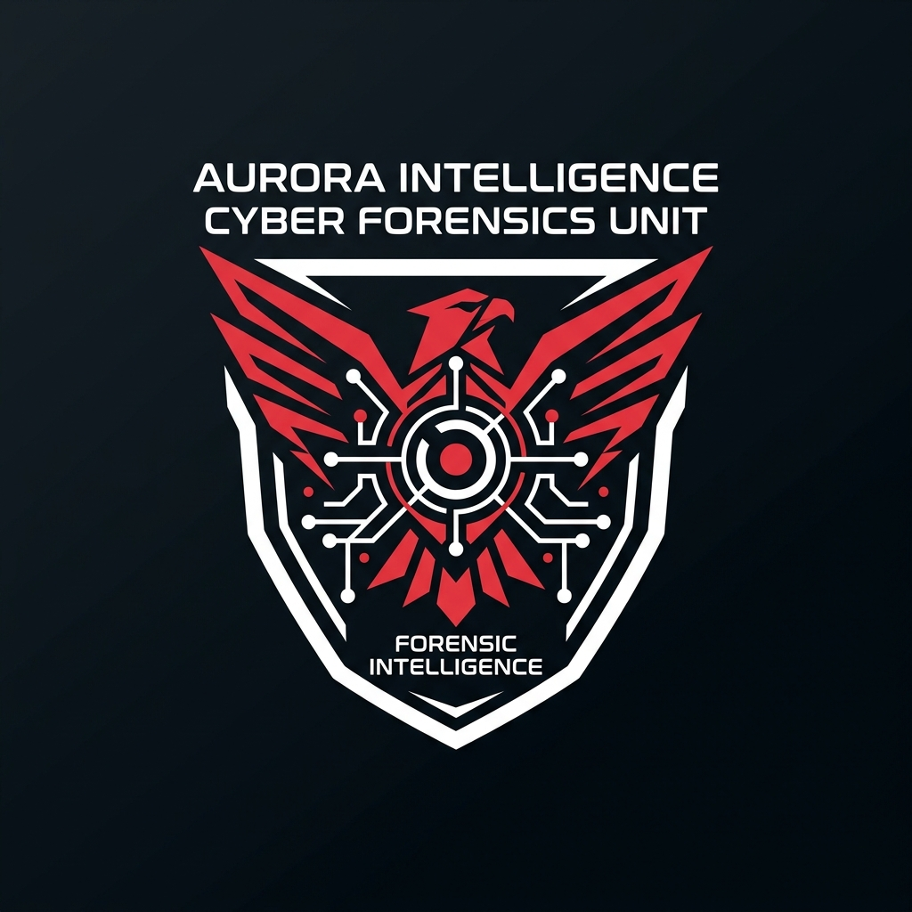
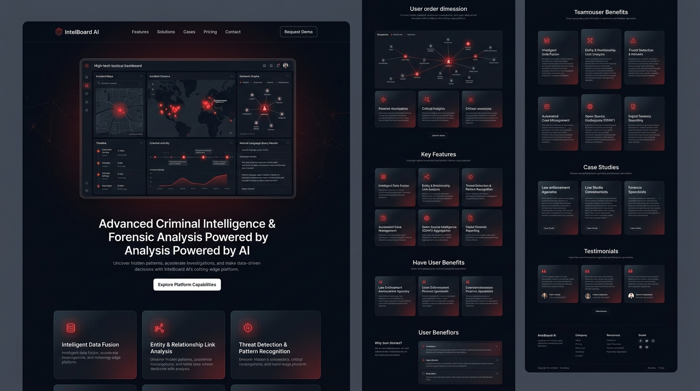
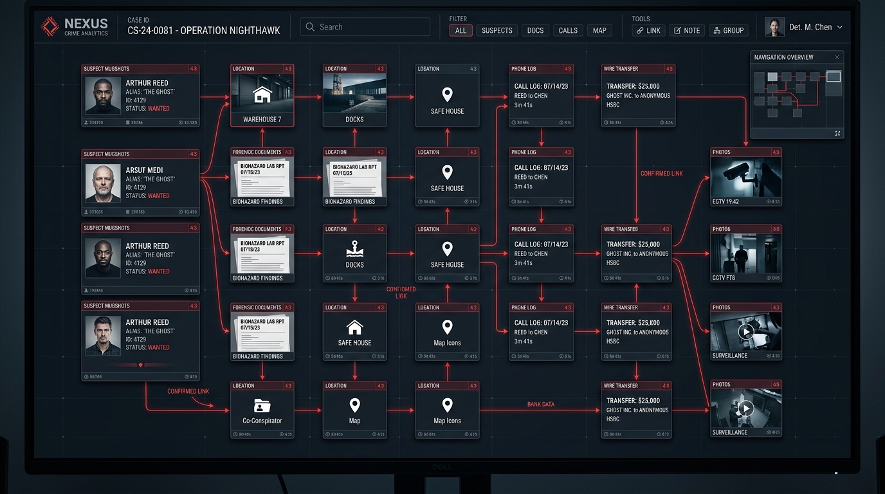
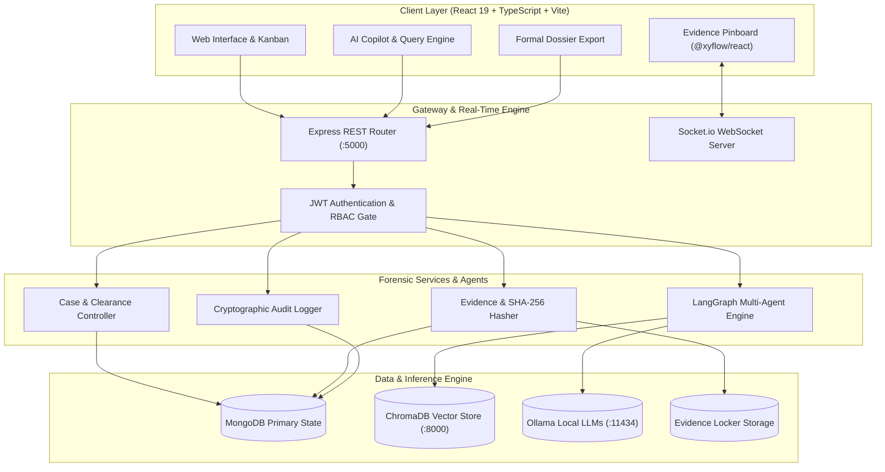
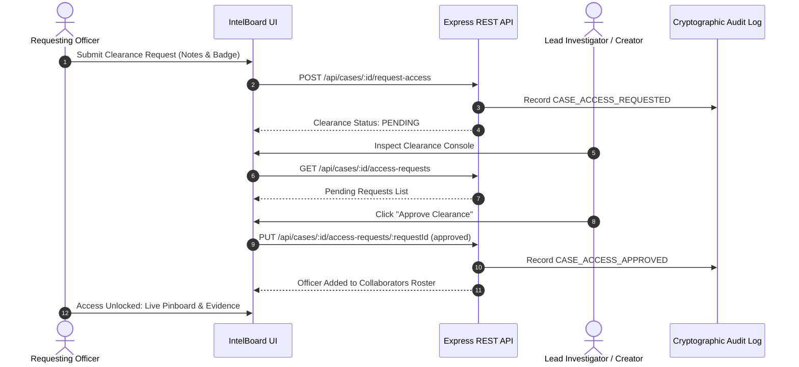

<div align="center">
  
  <h1>IntelBoard AI</h1>
  <p><strong>Enterprise Digital Forensics, Autonomous LangGraph Multi-Agent Reasoning & Collaborative Evidence Operating System</strong></p>

  <p>
    <a href="#system-architecture"></a>
    <a href="#technology-stack"></a>
    <a href="#technology-stack"></a>
    <a href="#technology-stack"></a>
    <a href="#technology-stack"></a>
    <a href="#technology-stack"></a>
    <a href="#technology-stack"></a>
    <a href="#technology-stack"></a>
    <a href="#technology-stack"></a>
    <a href="#docker-deployment"></a>
    <a href="#security-standards"></a>
  </p>
</div>

---

## 1. Mission Overview

IntelBoard AI is an enterprise-grade digital forensic investigation platform, autonomous multi-agent reasoning engine, and real-time collaborative evidentiary canvas. Engineered for law enforcement agencies, cyber defense units, and intelligence analysts, IntelBoard AI bridges multimodal evidentiary ingestion, LangGraph multi-agent autonomous reasoning, on-premises air-gapped local LLM inferencing, ChromaDB vector search, temporal anomaly detection, real-time WebSocket state synchronization, and court-admissible dossier compilation.

---

## 2. Visual Interface & Previews

### Modern SaaS Intelligence Portal
<div align="center">
  
</div>

### Collaborative Evidence Pinboard & Tactical Node Network
<div align="center">
  
</div>

---

## 3. Core Architectural Pillars

### Multimodal Evidence Vault & Cryptographic Chain of Custody
* **SHA-256 Evidentiary Fingerprinting**: Every ingested artifact (surveillance video, wiretap intercepts, forensic drive images, scanned manifests, and bank ledgers) receives an immutable cryptographic hash at intake to guarantee evidentiary non-repudiation.
* **OCR & Structured Parsing**: Automatically converts raw PDF manifests, financial records, and interrogation transcripts into normalized forensic representations.
* **Tamper-Proof Audit Logging**: Every view, download, status change, and connection is recorded with timestamps, officer identities, and IP metadata.

### Autonomous LangGraph Multi-Agent Reasoning Engine
The platform executes five specialized forensic agents orchestrated via `@langchain/langgraph`:
1. **Ingestion & Normalization Agent**: Parses unstructured raw dockets, transcripts, and evidence logs into structured state payloads.
2. **Named Entity Recognition (NER) Agent**: Discovers and classifies named entities including Suspects, Organizations, Shell Companies, Financial Accounts, Phone Numbers, Vehicles, and Geo-Locations.
3. **Link Discovery & Correlation Agent**: Computes relationship edges and cross-docket associations across disparate cases in the vector repository.
4. **Temporal Anomaly & Velocity Verifier**: Evaluates suspect alibis and timestamped appearances against spatial velocity models, flagging physical and logical contradictions.
5. **Dossier Synthesis Agent**: Generates executive briefs, risk indices, and actionable investigative leads supported by evidentiary citations.

### Air-Gapped Local LLM Inference & ChromaDB Vector Store
* **Zero-Exfiltration Air-Gapped Operation**: Native support for on-premises Local Large Language Models (`llama3`, `mistral`, `deepseek-r1`, `qwen2.5`) hosted via local Ollama instances.
* **Semantic Vector Retrieval**: High-density ChromaDB vector collections indexing evidentiary records for real-time Retrieval-Augmented Generation (RAG).

### Real-Time Collaboration & Case Clearance Gate
* **Case Clearance Request & Approval Gate**: Sealed case operations require investigators to submit formal access requests. Case Creators and Lead Officers review, approve, or reject access requests with an immutable audit trail.
* **Precision Pinboard State Sync**: Visual evidence boards synchronize in real-time across connected investigators using WebSocket data streams (`@xyflow/react` and Socket.io).
* **Live Forensic Memos**: Instantaneous precinct chat and memo stream broadcasted strictly within active case rooms.

---

## 4. System Architecture & Workflows

### System Architecture Flowchart



---

### LangGraph Multi-Agent StateGraph Pipeline

```mermaid
flowchart LR
    Start([Raw Police Reports & Transcripts]) --> Agent1[1. Ingestion & Normalizer]
    Agent1 --> Agent2[2. NER & Entity Classifier]
    Agent2 --> Agent3[3. Link Discovery Engine]
    Agent3 --> Agent4[4. Temporal Anomaly Verifier]
    Agent4 --> Agent5[5. Dossier Synthesis Agent]
    Agent5 --> Output([Court-Admissible Dossier & Risk Score])

    style Start fill:#18181b,stroke:#ef4444,stroke-width:2px,color:#fff
    style Agent1 fill:#09090b,stroke:#3f3f46,color:#fff
    style Agent2 fill:#09090b,stroke:#3f3f46,color:#fff
    style Agent3 fill:#09090b,stroke:#3f3f46,color:#fff
    style Agent4 fill:#09090b,stroke:#ef4444,color:#fff
    style Agent5 fill:#09090b,stroke:#3f3f46,color:#fff
    style Output fill:#18181b,stroke:#22c55e,stroke-width:2px,color:#fff
```



---

### Case Access Clearance & Approval Sequence



---

## 5. Technology Stack Matrix

| Domain | Technology | Version | Purpose |
| :--- | :--- | :--- | :--- |
| **Frontend Framework** | React | 19.2.0 | High-performance reactive UI rendering |
| **Language (Fullstack)** | TypeScript | 5.x | Strict domain type safety |
| **Build & Bundler** | Vite | 8.2.0 | Instant HMR and optimized production bundling |
| **Styling & Design** | Vanilla CSS / Tailwind | 4.x | High-contrast law enforcement Red/White/Black theme |
| **Graph & Canvas** | @xyflow/react | 12.x | Infinite visual node-edge evidence pinboard |
| **Motion & Micro-UI** | Framer Motion | 12.x | Smooth tactical transition states |
| **Icons** | React Icons (Feather) | 5.x | Minimalist interface iconography |
| **Backend Runtime** | Node.js | 20.x | Scalable asynchronous runtime |
| **Web Framework** | Express | 4.21.x | REST API endpoint routing and middleware |
| **Real-Time Engine** | Socket.io | 4.8.x | Low-latency bi-directional WebSocket syncing |
| **Agentic Framework** | LangGraph / LangChain | 0.2.x | Autonomous cyclic multi-agent stategraph engine |
| **Vector Database** | ChromaDB | Latest | Document embeddings and semantic similarity |
| **Local LLM Engine** | Ollama | Latest | Air-gapped on-premise model execution |
| **Primary Database** | MongoDB & Mongoose | 8.x | Document schema storage with relational refs |
| **Authentication** | JWT & BcryptJS | Latest | Cryptographic stateless sessions & password hashing |
| **Web Server / Reverse Proxy** | Nginx | Alpine | Static asset hosting, SSL termination, and proxy |
| **Containerization** | Docker & Compose | Latest | Multi-container unified deployment |

---

## 6. Complete REST API Reference

### Authentication Endpoints (`/api/auth`)
| Method | Route | Access | Description |
| :--- | :--- | :--- | :--- |
| `POST` | `/api/auth/register` | Public | Enlists a new agency profile and creates an officer account |
| `POST` | `/api/auth/login` | Public | Authenticates officer credentials and issues signed JWT |
| `GET` | `/api/auth/me` | Private | Retrieves current authenticated officer profile |
| `POST` | `/api/auth/logout` | Private | Clears session cookie and invalidates client session |

### Case Operations & Clearance Endpoints (`/api/cases`)
| Method | Route | Access | Description |
| :--- | :--- | :--- | :--- |
| `GET` | `/api/cases` | Private | Retrieves all accessible investigation cases with filters |
| `GET` | `/api/cases/:id` | Private | Retrieves single case with computed live metrics |
| `POST` | `/api/cases` | Investigator | Initiates a new investigation case operation |
| `PATCH` | `/api/cases/:id/status` | Investigator | Transitions case through Kanban operational phases |
| `POST` | `/api/cases/:id/request-access` | Private | Submits a clearance request to collaborate on a case |
| `PUT` | `/api/cases/:id/access-requests/:requestId` | Lead / Admin | Approves or rejects an access clearance request |
| `GET` | `/api/cases/:id/access-requests` | Private | Retrieves full access request history and authorized roster |
| `DELETE` | `/api/cases/:id` | Admin | Permanently archives and deletes a case record |

### Evidence Vault Endpoints (`/api/evidence`)
| Method | Route | Access | Description |
| :--- | :--- | :--- | :--- |
| `GET` | `/api/evidence/case/:caseId` | Private | Retrieves all evidence records for a specific case |
| `POST` | `/api/evidence` | Investigator | Ingests new evidence record with SHA-256 digital stamp |
| `PATCH` | `/api/evidence/:id/review` | Supervisor | Approves, rejects, or flags evidence review status |
| `DELETE` | `/api/evidence/:id` | Admin | Purges evidence artifact from the registry |

### Artificial Intelligence & Multi-Agent Endpoints (`/api/ai` & `/api/agents`)
| Method | Route | Access | Description |
| :--- | :--- | :--- | :--- |
| `POST` | `/api/ai/query` | Private | Queries RAG system grounded in case evidence embeddings |
| `POST` | `/api/ai/summarize-evidence` | Private | Generates forensic summary for ingested artifact |
| `POST` | `/api/agents/langgraph/run` | Private | Triggers autonomous 5-agent LangGraph stategraph analysis |

---

## 7. Real-Time WebSocket Protocols

### Client ➔ Server Events
| Event Name | Payload | Description |
| :--- | :--- | :--- |
| `join_case` | `{ caseId, user }` | Joins a secure room for real-time collaboration |
| `case_chat_message` | `{ caseId, message, user }` | Broadcasts an investigative memo to the case room |
| `board_update` | `{ caseId, nodes, edges, updatedBy }` | Syncs pinboard node movements and edge links |
| `evidence_ingested` | `{ caseId, evidence, ingestedBy }` | Notifies active detectives of new evidence intake |

### Server ➔ Client Broadcasts
| Event Name | Payload | Description |
| :--- | :--- | :--- |
| `case_roster_update` | `ActiveCollaborator[]` | Broadcasts live connected detective roster |
| `remote_case_message` | `CaseChatMessage` | Delivers real-time memo to all detectives in room |
| `remote_board_update` | `{ caseId, nodes, edges }` | Updates canvas positions across peer viewports |
| `remote_evidence_added`| `{ caseId, evidence }` | Renders incoming evidence in the live vault |

---

## 8. Operational Pages & Feature Matrix

1. **SaaS Landing Page (`/`)**: Overview of the platform, modular capabilities, air-gapped security, and agency enlistment gateway.
2. **Investigation Dashboard (`/dashboard`)**: Tactical cockpit displaying active surveillance streams, AI risk indicators, and priority case summaries.
3. **Cases Kanban Matrix (`/cases`)**: Interactive drag-and-drop board tracking cases through investigation stages (`New Intake` ➔ `Active` ➔ `Under Investigation` ➔ `Review` ➔ `Closed`).
4. **Case Details Cockpit (`/cases/:caseId`)**: Multi-tab investigation station with Working Hypotheses, Evidence Vault, Suspect Profiles, Real-Time Socket Memos, and Clearance Approvals.
5. **Collaborative Evidence Pinboard (`/cases/:caseId/board`)**: Infinite visual canvas with red-string node links and real-time WebSocket state broadcasting.
6. **Entity Relationship Graph (`/cases/:caseId/graph`)**: Directed graph depicting suspect hierarchies, shell corporations, and asset transfers.
7. **Crime Timeline & Velocity Engine (`/cases/:caseId/timeline`)**: Chronological event sequencing with automated alibi travel contradiction alerts.
8. **AI Intelligence Hub (`/cases/:caseId/ai-hub`)**: Autonomous multi-agent LangGraph workflow execution with ChromaDB semantic vector search.
9. **Formal Dossier Reports (`/cases/:caseId/reports`)**: Formatted case dossier and chain-of-custody report with 1-click print and PDF export.
10. **Forensic Audit Stream (`/audit-logs`)**: Immutable logging of every evidence touch, status transition, and user action.

---

## 9. Quickstart & Local Setup

### Prerequisites
* Node.js `20.x` or later
* MongoDB running locally (`mongodb://localhost:27017`) or MongoDB Atlas URI
* (Optional) Ollama running on `http://localhost:11434`
* (Optional) ChromaDB running on `http://localhost:8000`

### Step 1: Clone Repository
```bash
git clone https://github.com/Next-Gen-Coder-2007/Crime-Investigation.git
cd Crime-Investigation
```

### Step 2: Backend Configuration & Start
```bash
cd backend
npm install
npm run build
npm start
```
The backend API and WebSocket listener will initialize on `http://localhost:5000`.

### Step 3: Frontend Client Start
```bash
cd ../frontend
npm install
npm run dev
```
The client application will start on `http://localhost:5173`.

---

## 10. One-Command Docker Deployment

Deploy the entire 5-container architecture (Frontend, Backend, MongoDB, ChromaDB, Ollama) on any server or workstation:

```bash
docker compose up --build -d
```

### Deployed Services & Ports
* **Frontend Web Application (Nginx)**: `http://localhost:80`
* **Backend API & WebSockets**: `http://localhost:5000`
* **ChromaDB Vector Database**: `http://localhost:8000`
* **Ollama Local LLM Endpoint**: `http://localhost:11434`
* **MongoDB Database**: `mongodb://localhost:27017`

---

## 11. Security, Compliance & Non-Repudiation

* **Stateless Security**: Cryptographic JSON Web Tokens (JWT) with HTTP-only cookies and Bearer token headers.
* **Role-Based Clearance**: Enforces compartmentalized clearance tiers across investigators, supervisors, and administrative personnel.
* **Audit Non-Repudiation**: Immutable tracking of every case access, status change, evidence intake, and export action.
* **Air-Gapped Privacy**: Zero data leakage when operating with on-premises Local LLM instances.

---

## 12. Intellectual Property & Rights

IntelBoard AI — Forensic Criminal Intelligence & Digital Investigation Platform. Proprietary Software. All Rights Reserved.